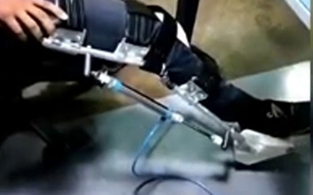
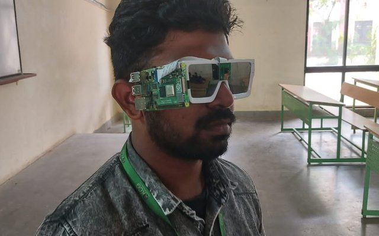
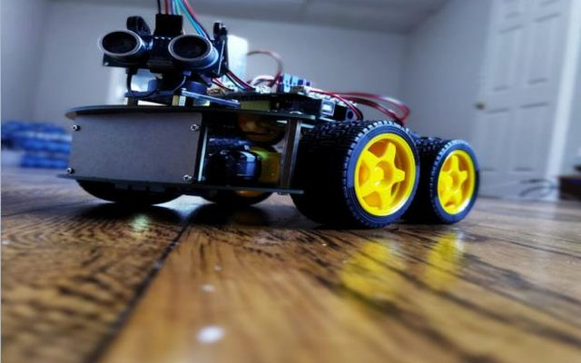
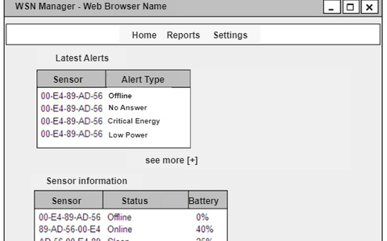

# Mohamed Rizwan Ameer John

**Embedded Software · Firmware · Robotics**

I write the firmware that makes hardware behave: C on ARM Cortex-M, sensors, motors, valves and on-device ML.

📍 Chicago, IL · Open to relocation · MS Computer Science, Governors State University (2026)

---

### About me

- 🔧 Embedded and firmware engineer with a BE in Electrical & Electronics Engineering and an MS in Computer Science
- 🦿 Built assistive hardware end to end: a pneumatic knee exoskeleton, sign-language smart glasses and a learning robot
- 📜 Three Indian patent applications · IEEE YESIST12 International Finalist · IIT PALS Winner
- 🚗 Currently building a **CAN vehicle-network gear controller** on STM32 + FreeRTOS, with requirement-traced unit tests and CI
- 💼 Looking for **Embedded Software, Firmware and Embedded Systems Engineer** roles. No employer sponsorship required for the first three years of employment - F-1 STEM OPT eligible (12-month OPT plus 24-month STEM extension).

---

### Featured hardware projects

<table>
  <tr>
    <td width="50%" valign="top">
      
      <h4><a href="https://github.com/MohamedRizwan461/smart-knee-actuator">Smart Knee Actuator</a></h4>
      Wearable pneumatic knee exoskeleton. MPU6050 IMU and a TinyML gait-phase classifier on an RP2040 drive a solenoid valve and cylinder. 
      📜 Indian patent application 202341027059  
      <code>C/C++</code> <code>RP2040</code> <code>TinyML</code> <code>I2C</code> <code>Pneumatics</code> <code>FEA</code>
    </td>
    <td width="50%" valign="top">
      
      <h4><a href="https://github.com/MohamedRizwan461/sign-language-eyewear">Sign Language Interpreting Eyewear</a></h4>
      Glasses with a built-in camera that read Indian Sign Language gestures and speak them aloud in real time, on a Raspberry Pi 4B. 
      📜 Indian patent application filed Feb 2023  
      <code>Python</code> <code>OpenCV</code> <code>MediaPipe</code> <code>Raspberry Pi</code> <code>Edge AI</code>
    </td>
  </tr>
  <tr>
    <td width="50%" valign="top">
      
      <h4><a href="https://github.com/MohamedRizwan461/autonomous-mobile-robot">Autonomous Mobile Robot</a></h4>
      Differential-drive robot that learns to navigate with Q-Learning and epsilon-greedy exploration, written in Arduino C++ and trained in simulation first.  
      <code>C++</code> <code>Arduino</code> <code>Q-Learning</code> <code>MATLAB</code> <code>HIL testing</code>
    </td>
    <td width="50%" valign="top">
      
      <h4><a href="https://github.com/MohamedRizwan461/rfid-iot-attendance-system">RFID IoT Attendance / WSN Platform</a></h4>
      RFID reader and ESP8266 nodes feeding a cloud dashboard for sensor alerts, node status and battery levels. 
      📜 Indian patent application 202341008938  
      <code>ESP8266</code> <code>RFID</code> <code>SPI/UART</code> <code>IoT</code> <code>Apps Script</code>
    </td>
  </tr>
</table>

### More projects

| Project | What it is | Links |
|---|---|---|
| **CAN Vehicle Network Gear Controller** 🚧 | Two-node STM32 gear-state controller with safety interlocks, J1939-style frames, FreeRTOS, Unity tests and GitHub Actions | [Details](https://riz-robotics.vercel.app/projects/can-gear-controller) |
| **AI-Driven Supply Chain Risk Predictor** | MS final project (team of 3). Predicts shipment delay; Gradient Boosting, MAE 0.422 days | [Live app](https://supply-chain-risk.streamlit.app) · [Code](https://github.com/MohamedRizwan461/supply-chain-risk) |
| **FCHEV Boost Converter (ASMC)** | Adaptive sliding mode control for a 12–18 V → 36 V boost converter, with a Lyapunov stability proof | [Write-up](https://github.com/MohamedRizwan461/fchev-boost-converter-asmc) |
| **Soft Robotic Glove** | Stroke-rehabilitation glove; led a 12-person team, D-H hand kinematics, SOFA FEA | [Write-up](https://github.com/MohamedRizwan461/soft-robotic-glove) |
| **Interactive Portfolio** | 3D circuit board where a robot drives to each project. Next.js, three.js | [Live site](https://riz-robotics.vercel.app) · [Code](https://github.com/MohamedRizwan461/portfolio) |

---

### Tech stack

**Embedded:**       
RP2040 · FreeRTOS · CAN · I2C · SPI · UART

**Controls & simulation:**  
PID · Sliding mode control · Q-Learning · SOFA FEA

**Vision & ML:**    
MediaPipe · TinyML

**Tools:**    
Oscilloscope · Logic analyzer · Li-Po power + buck converters

---

### Recognition

- 🏆 **IEEE YESIST12 International Finalist**: Grand Finale, Maker Fair Track, Egypt (Sep 2023)
- 🥇 **IIT PALS Winner**: IIT Madras (Oct 2022)
- 🚘 **Build Fellowship**: Tesla FCW / AEB safety study (Mar–Apr 2025)
- 📜 **3 Indian patent applications**: knee exoskeleton, sign-language eyewear, WSN management platform
